# Web Intelligence Platform Architecture

Status: accepted implementation boundary for HEL-58

Web Intelligence is a reusable, self-hostable intelligence engine. It is
separate from both Bookmark Intelligence Platform and Service Business
Software Media. Service Business Software Media is the first consuming
product; it does not own crawler, AI-orchestration or security infrastructure.

## System boundary

The platform converts approved sources into traceable, reviewable outputs:

```mermaid
flowchart LR
    A[Approved source policy] --> B[URL and redirect guard]
    B --> C[Crawl job]
    C --> D[Browser or HTTP worker]
    D --> E[Raw immutable snapshot]
    E --> F[Extractor]
    F --> G[Normalized facts and entities]
    G --> H[Claims, evidence and provenance]
    H --> I[Change and conflict detection]
    I --> J[Local AI proposal]
    J --> K[Schema and deterministic policy validation]
    K --> L[Quality and security gate]
    L --> M[Draft or staging]
    M --> N[Explicit approval]
    N --> O[Privileged publisher]
    O --> P[Destination and audit log]
```



There is no direct scrape-to-rewrite-to-publish path. AI output is a
structured proposal and never executable authority.

## Modules

| Module                      | Responsibility                                                                               | Must not do                                                               |
| --------------------------- | -------------------------------------------------------------------------------------------- | ------------------------------------------------------------------------- |
| API/control plane           | Authenticate operators, accept approved source jobs, expose read models and job status       | Fetch arbitrary URLs or publish directly                                  |
| Source policy and URL guard | Normalize URLs, enforce schemes/allowlists/budgets, resolve and revalidate redirects         | Trust user or model-supplied destinations                                 |
| HTTP crawler                | Fetch permitted static pages within budgets                                                  | Read publisher secrets or write authoritative facts                       |
| Browser worker              | Render permitted JavaScript pages and capture bounded results                                | Access host filesystem, Docker socket, SSH agent or publisher credentials |
| Raw snapshot store          | Store content-addressed raw HTML/assets and retrieval metadata                               | Treat page content as executable instructions                             |
| Extractor                   | Turn snapshots into structured candidate documents and metadata                              | Declare unsupported claims authoritative                                  |
| Intelligence core           | Normalize entities, facts, claims, evidence, conflicts and changes                           | Replace evidence with generated prose                                     |
| AI worker                   | Produce versioned, typed analysis/draft proposals using local models                         | Call network/shell/filesystem/publisher tools or change policy            |
| Quality/security gate       | Validate schemas, provenance, freshness, policy and content safety                           | Approve publication by itself                                             |
| Publisher                   | Apply approved publication objects to a configured destination with idempotency and rollback | Crawl, infer facts or accept raw model output                             |
| Admin UI                    | Show jobs, evidence, conflicts, drafts, approvals and operational controls                   | Bypass server-side policy                                                 |

## Trust zones and data flow

1. **Control zone** — API, admin UI and policy configuration. This is the only
   zone allowed to create jobs or approve publication.
2. **Untrusted execution zone** — HTTP crawler, browser worker, extractor and
   AI worker. Internet content, rendered DOM, metadata, PDFs and model output
   are hostile input here.
3. **Evidence/data zone** — PostgreSQL and raw snapshot storage. Evidence is
   immutable by reference; normalized records retain source and parser
   provenance.
4. **Privileged publication zone** — a separate publisher process with
   destination-specific least-privilege credentials. It accepts validated
   `Publication` objects only.
5. **External destination zone** — WordPress REST or a later static/headless
   adapter. The destination is never treated as the platform source of truth.

The only permitted privileged path is:

```text
approved source -> guarded job -> untrusted workers -> evidence/data
-> validated proposal -> quality gate -> explicit approval -> publisher
```

## Data model boundary

The canonical entities are `Source`, `Crawl`, `Snapshot`, `Document`,
`Entity`, `Product`, `Claim`, `Evidence`, `Fact`, `Conflict`, `Change`,
`Opportunity`, `ContentAsset`, `Publication` and `PerformanceMetric`.

Every displayed commercial fact must be reconstructable from evidence with:

- source URL and retrieval timestamp;
- extraction method and parser version;
- confidence and verification state;
- immutable snapshot reference/hash; and
- the claims and downstream content affected by later changes.

Generated text is never authoritative evidence.

## Failure and recovery model

- Job requests use stable idempotency keys.
- Raw snapshots are content-addressed; unchanged content does not create a
  false change event.
- Retries are bounded per job and per domain, with visible dead-letter state.
- Crawl, extraction, intelligence and publication are separate failure
  domains; a worker failure cannot partially publish content.
- Publication uses a dry-run diff, stable external IDs and a previous known
  good state for rollback.
- Global and per-domain crawl pause, AI pause and publisher kill switches are
  control-plane actions and are audited.

## Dependency and deployment boundary

The MVP remains a Python monolith with separate rootless worker processes or
containers, not unnecessary microservices. The required open-source baseline
is Python, uv, Ruff, FastAPI, Pydantic, SQLAlchemy/Alembic, Scrapy,
Playwright, Trafilatura, PostgreSQL, Celery, Valkey, Ollama/Qwen3 and Typst.

The platform must run without paid APIs or SaaS subscriptions. Optional
components such as pgvector, SearXNG, LangGraph, PydanticAI, Crawlee,
Temporal and Meilisearch require a measured requirement before introduction.

Workers run rootless where possible, with read-only filesystems, dedicated
temporary/snapshot volumes, no host mounts, no Docker socket and no publisher
credentials. Secrets are injected only into the service that needs them and
are never committed or sent to model context.

## Explicit MVP non-goals

- direct production auto-publishing from crawler or AI output;
- paid search, SEO or AI APIs as mandatory dependencies;
- a general-purpose marketplace or multi-tenant SaaS product;
- broad programmatic content generation without evidence;
- a separate search engine before PostgreSQL FTS and measured retrieval needs;
- mobile UI implementation in the Web Intelligence core;
- coupling the platform to the home-service niche or one CMS.

## Consumer integration contract

Service Business Software Media consumes versioned exports/API objects. It
owns editorial decisions, disclosures, rankings, monetization and public-site
analytics. It receives normalized Product/Claim/Evidence/Change data, never
raw crawler access or publisher credentials. Stale or conflicting facts must
be surfaced for editorial review and must not auto-publish.
